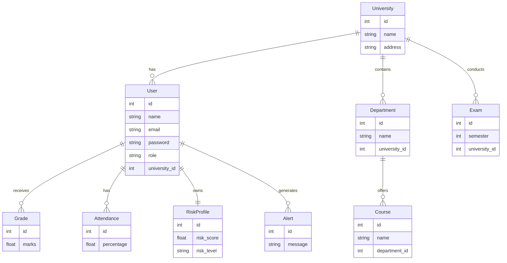

# ER Diagram – UniMetrics (Multi-Tenant)

```mermaid
erDiagram

University ||--o{ User : has
University ||--o{ Department : contains
Department ||--o{ Course : offers
University ||--o{ Exam : conducts
User ||--o{ Grade : receives
User ||--o{ Attendance : has
User ||--|| RiskProfile : owns
User ||--o{ Alert : generates

University {
  int id
  string name
  string address
}

User {
  int id
  string name
  string email
  string password
  string role
  int university_id
}

Department {
  int id
  string name
  int university_id
}

Course {
  int id
  string name
  int department_id
}

Exam {
  int id
  int semester
  int university_id
}

Grade {
  int id
  float marks
}

Attendance {
  int id
  float percentage
}

RiskProfile {
  int id
  float risk_score
  string risk_level
}

Alert {
  int id
  string message
}
```
