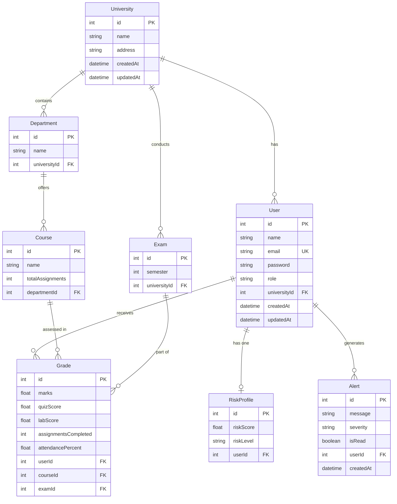

# ER Diagram – UniMetrics (Multi-Tenant, Multi-Factor Academic Intelligence)

## Risk Score Computation

| Factor | Weight | Source |
|---|---|---|
| Exam / Mid-term | 35% | `Grade.marks` |
| Quiz Score | 15% | `Grade.quizScore` |
| Lab / Practical | 15% | `Grade.labScore` |
| Assignments | 20% | `Grade.assignmentsCompleted / Course.totalAssignments × 100` |
| Attendance | 15% | `Grade.attendancePercent` |

**Composite ≥ 70 → LOW | 50–69 → MEDIUM | < 50 → HIGH**
