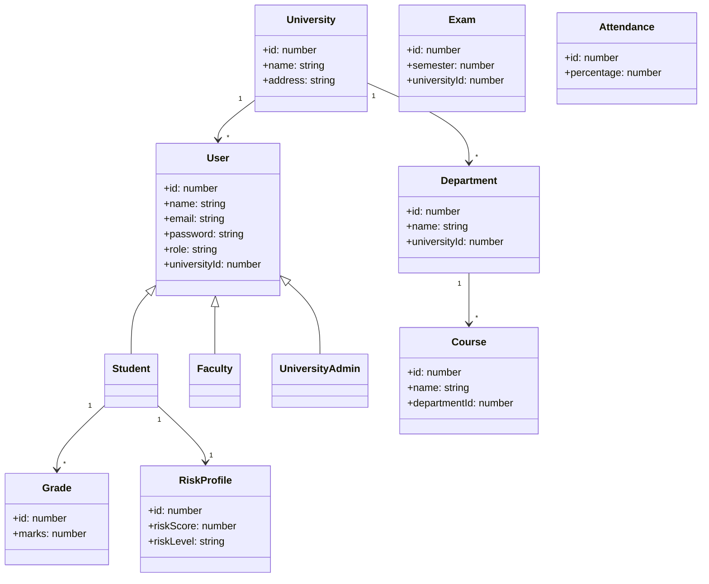

# Class Diagram – UniMetrics

```mermaid
classDiagram

class University {
  +id: number
  +name: string
  +address: string
}

class User {
  +id: number
  +name: string
  +email: string
  +password: string
  +role: string
  +universityId: number
}

class Student
class Faculty
class UniversityAdmin

User <|-- Student
User <|-- Faculty
User <|-- UniversityAdmin

class Department {
  +id: number
  +name: string
  +universityId: number
}

class Course {
  +id: number
  +name: string
  +departmentId: number
}

class Exam {
  +id: number
  +semester: number
  +universityId: number
}

class Grade {
  +id: number
  +marks: number
}

class Attendance {
  +id: number
  +percentage: number
}

class RiskProfile {
  +id: number
  +riskScore: number
  +riskLevel: string
}

University "1" --> "*" Department
University "1" --> "*" User
Department "1" --> "*" Course
Student "1" --> "*" Grade
Student "1" --> "1" RiskProfile
```
