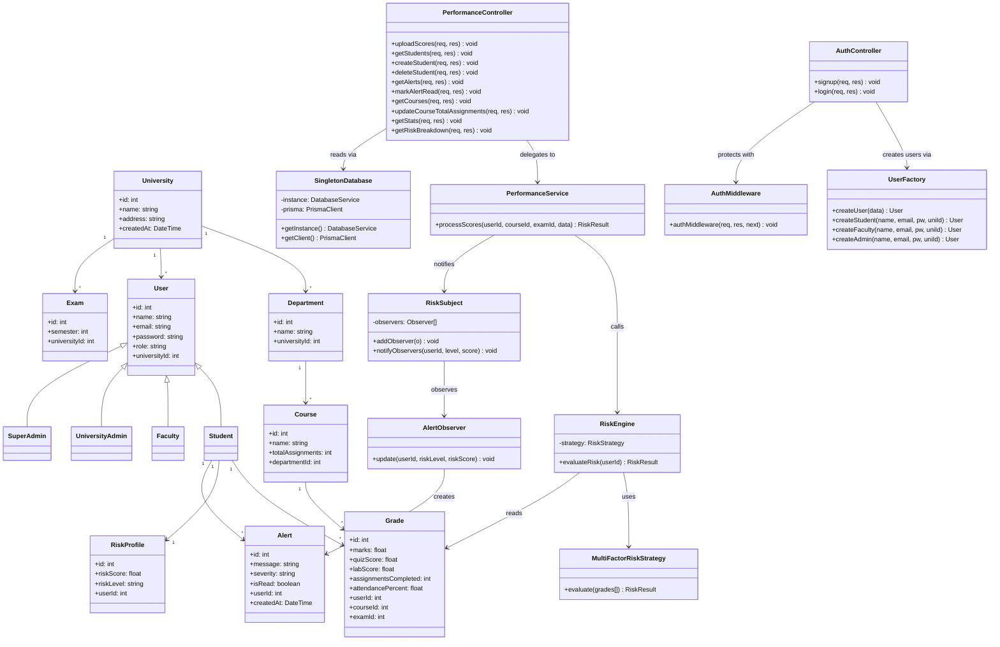

# Class Diagram – UniMetrics

```mermaid
classDiagram

%% ─── Domain Models ───────────────────────
class University {
  +id: int
  +name: string
  +address: string
  +createdAt: DateTime
}

class User {
  +id: int
  +name: string
  +email: string
  +password: string
  +role: string
  +universityId: int
}

class Student
class Faculty
class UniversityAdmin
class SuperAdmin

User <|-- Student
User <|-- Faculty
User <|-- UniversityAdmin
User <|-- SuperAdmin

class Department {
  +id: int
  +name: string
  +universityId: int
}

class Course {
  +id: int
  +name: string
  +totalAssignments: int
  +departmentId: int
}

class Exam {
  +id: int
  +semester: int
  +universityId: int
}

class Grade {
  +id: int
  +marks: float
  +quizScore: float
  +labScore: float
  +assignmentsCompleted: int
  +attendancePercent: float
  +userId: int
  +courseId: int
  +examId: int
}

class RiskProfile {
  +id: int
  +riskScore: float
  +riskLevel: string
  +userId: int
}

class Alert {
  +id: int
  +message: string
  +severity: string
  +isRead: boolean
  +userId: int
  +createdAt: DateTime
}

%% ─── Patterns ────────────────────────────
class UserFactory {
  +createUser(data) User
  +createStudent(name, email, pw, uniId) User
  +createFaculty(name, email, pw, uniId) User
  +createAdmin(name, email, pw, uniId) User
}

class AuthController {
  +signup(req, res) void
  +login(req, res) void
}

class AuthMiddleware {
  +authMiddleware(req, res, next) void
}

class MultiFactorRiskStrategy {
  +evaluate(grades[]) RiskResult
}

class RiskEngine {
  -strategy: RiskStrategy
  +evaluateRisk(userId) RiskResult
}

class AlertObserver {
  +update(userId, riskLevel, riskScore) void
}

class RiskSubject {
  -observers: Observer[]
  +addObserver(o) void
  +notifyObservers(userId, level, score) void
}

class SingletonDatabase {
  -instance: DatabaseService
  -prisma: PrismaClient
  +getInstance() DatabaseService
  +getClient() PrismaClient
}

class PerformanceService {
  +processScores(userId, courseId, examId, data) RiskResult
}

class PerformanceController {
  +uploadScores(req, res) void
  +getStudents(req, res) void
  +createStudent(req, res) void
  +deleteStudent(req, res) void
  +getAlerts(req, res) void
  +markAlertRead(req, res) void
  +getCourses(req, res) void
  +updateCourseTotalAssignments(req, res) void
  +getStats(req, res) void
  +getRiskBreakdown(req, res) void
}

%% ─── Relationships ───────────────────────
University "1" --> "*" Department
University "1" --> "*" User
University "1" --> "*" Exam
Department "1" --> "*" Course
Course "1" --> "*" Grade

Student "1" --> "*" Grade
Student "1" --> "1" RiskProfile
Student "1" --> "*" Alert

RiskEngine --> MultiFactorRiskStrategy : uses
RiskEngine --> Grade : reads
PerformanceService --> RiskEngine : calls
PerformanceService --> RiskSubject : notifies
RiskSubject --> AlertObserver : observes
AlertObserver --> Alert : creates

AuthController --> UserFactory : creates users via
AuthController --> AuthMiddleware : protects with
PerformanceController --> PerformanceService : delegates to
PerformanceController --> SingletonDatabase : reads via
```
