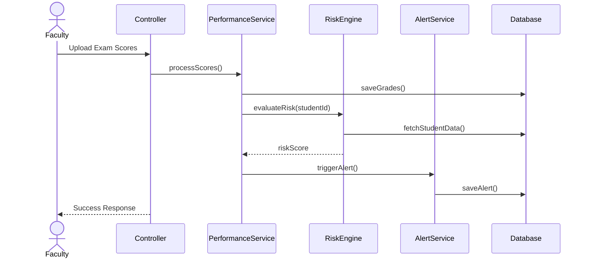

# Sequence Diagram – Exam Upload to Risk Alert

```mermaid
sequenceDiagram

actor Faculty
participant Controller
participant PerformanceService
participant RiskEngine
participant AlertService
participant Database

Faculty->>Controller: Upload Exam Scores
Controller->>PerformanceService: processScores()
PerformanceService->>Database: saveGrades()
PerformanceService->>RiskEngine: evaluateRisk(studentId)
RiskEngine->>Database: fetchStudentData()
RiskEngine-->>PerformanceService: riskScore
PerformanceService->>AlertService: triggerAlert()
AlertService->>Database: saveAlert()
Controller-->>Faculty: Success Response
```
