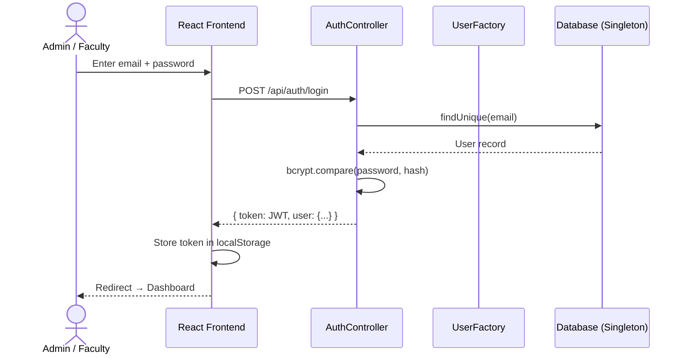
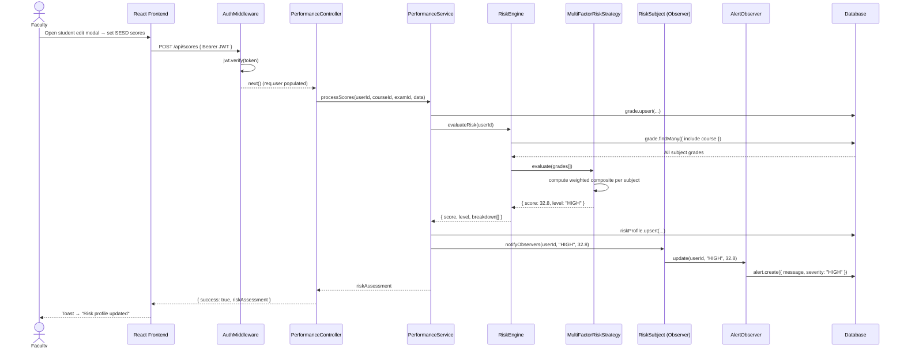
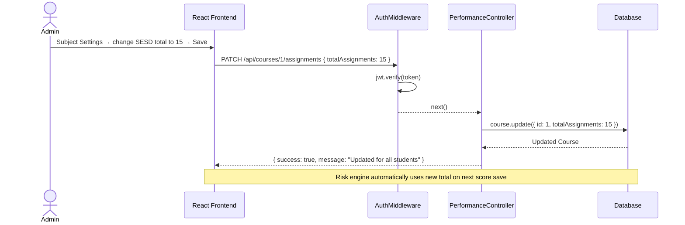

# Sequence Diagram – UniMetrics Complete Flow

## 1. Authentication Flow

```mermaid
sequenceDiagram
  actor Admin as Admin / Faculty
  participant FE as React Frontend
  participant Auth as AuthController
  participant UF as UserFactory
  participant DB as Database (Singleton)

  Admin->>FE: Enter email + password
  FE->>Auth: POST /api/auth/login
  Auth->>DB: findUnique(email)
  DB-->>Auth: User record
  Auth->>Auth: bcrypt.compare(password, hash)
  Auth-->>FE: { token: JWT, user: {...} }
  FE->>FE: Store token in localStorage
  FE-->>Admin: Redirect → Dashboard
```

---

## 2. Score Entry & Risk Recalculation Flow

```mermaid
sequenceDiagram
  actor Faculty
  participant FE as React Frontend
  participant MW as AuthMiddleware
  participant PC as PerformanceController
  participant PS as PerformanceService
  participant RE as RiskEngine
  participant MF as MultiFactorRiskStrategy
  participant RS as RiskSubject (Observer)
  participant AO as AlertObserver
  participant DB as Database

  Faculty->>FE: Open student edit modal → set SESD scores
  FE->>MW: POST /api/scores { Bearer JWT }
  MW->>MW: jwt.verify(token)
  MW-->>PC: next() (req.user populated)
  PC->>PS: processScores(userId, courseId, examId, data)
  PS->>DB: grade.upsert(...)
  PS->>RE: evaluateRisk(userId)
  RE->>DB: grade.findMany({ include course })
  DB-->>RE: All subject grades
  RE->>MF: evaluate(grades[])
  MF->>MF: compute weighted composite per subject
  MF-->>RE: { score: 32.8, level: "HIGH" }
  RE-->>PS: { score, level, breakdown[] }
  PS->>DB: riskProfile.upsert(...)
  PS->>RS: notifyObservers(userId, "HIGH", 32.8)
  RS->>AO: update(userId, "HIGH", 32.8)
  AO->>DB: alert.create({ message, severity: "HIGH" })
  PS-->>PC: riskAssessment
  PC-->>FE: { success: true, riskAssessment }
  FE-->>Faculty: Toast → "Risk profile updated"
```

---

## 3. Global Assignment Update Flow

```mermaid
sequenceDiagram
  actor Admin
  participant FE as React Frontend
  participant MW as AuthMiddleware
  participant PC as PerformanceController
  participant DB as Database

  Admin->>FE: Subject Settings → change SESD total to 15 → Save
  FE->>MW: PATCH /api/courses/1/assignments { totalAssignments: 15 }
  MW->>MW: jwt.verify(token)
  MW-->>PC: next()
  PC->>DB: course.update({ id: 1, totalAssignments: 15 })
  DB-->>PC: Updated Course
  PC-->>FE: { success: true, message: "Updated for all students" }
  Note over DB,FE: Risk engine automatically uses new total on next score save
```
