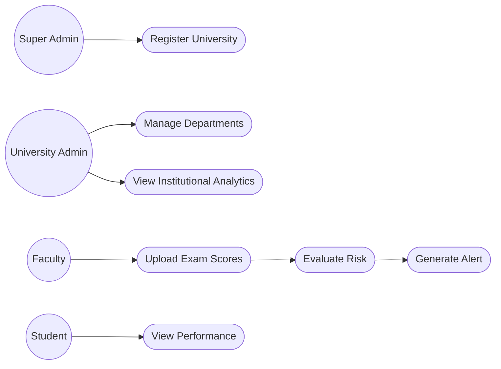

# Use Case Diagram – UniMetrics

```mermaid
flowchart LR

SuperAdmin((Super Admin))
UniversityAdmin((University Admin))
Faculty((Faculty))
Student((Student))

RegisterUniversity([Register University])
ManageDepartments([Manage Departments])
UploadScores([Upload Exam Scores])
ViewAnalytics([View Institutional Analytics])
ViewPerformance([View Performance])
EvaluateRisk([Evaluate Risk])
GenerateAlert([Generate Alert])

SuperAdmin --> RegisterUniversity
UniversityAdmin --> ManageDepartments
Faculty --> UploadScores
UniversityAdmin --> ViewAnalytics
Student --> ViewPerformance

UploadScores --> EvaluateRisk
EvaluateRisk --> GenerateAlert
```
