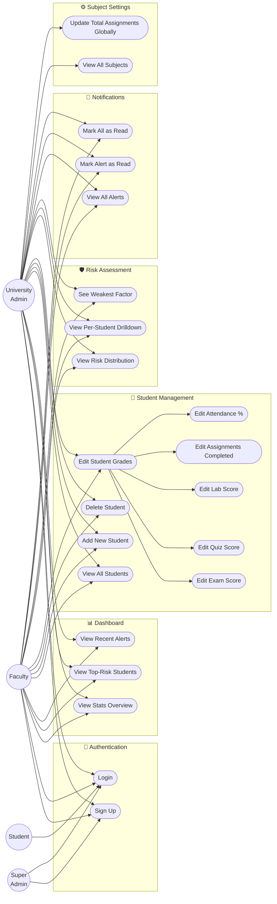

# Use Case Diagram – UniMetrics

```mermaid
flowchart LR

  %% Actors
  SA(("Super\nAdmin"))
  UA(("University\nAdmin"))
  FA(("Faculty"))
  ST(("Student"))

  %% Auth use cases
  subgraph AUTH ["🔐 Authentication"]
    UC1([Sign Up])
    UC2([Login])
  end

  %% Dashboard use cases
  subgraph DASH ["📊 Dashboard"]
    UC3([View Stats Overview])
    UC4([View Top-Risk Students])
    UC5([View Recent Alerts])
  end

  %% Student management
  subgraph SMGMT ["👤 Student Management"]
    UC6([View All Students])
    UC7([Add New Student])
    UC8([Delete Student])
    UC9([Edit Student Grades])
    UC10([Edit Exam Score])
    UC11([Edit Quiz Score])
    UC12([Edit Lab Score])
    UC13([Edit Assignments Completed])
    UC14([Edit Attendance %])
  end

  %% Risk
  subgraph RISK ["🛡 Risk Assessment"]
    UC15([View Risk Distribution])
    UC16([View Per-Student Drilldown])
    UC17([See Weakest Factor])
  end

  %% Notifications
  subgraph NOTIF ["🔔 Notifications"]
    UC18([View All Alerts])
    UC19([Mark Alert as Read])
    UC20([Mark All as Read])
  end

  %% Subject Settings
  subgraph SETTINGS ["⚙ Subject Settings"]
    UC21([View All Subjects])
    UC22([Update Total Assignments Globally])
  end

  %% Actor Connections
  SA --> UC1 & UC2
  UA --> UC1 & UC2
  FA --> UC1 & UC2
  ST --> UC2

  UA & FA --> UC3 & UC4 & UC5
  UA & FA --> UC6 & UC7 & UC8
  UA & FA --> UC9
  UC9 --> UC10 & UC11 & UC12 & UC13 & UC14
  UA & FA --> UC15 & UC16 & UC17
  UA & FA --> UC18 & UC19 & UC20
  UA --> UC21 & UC22
```
